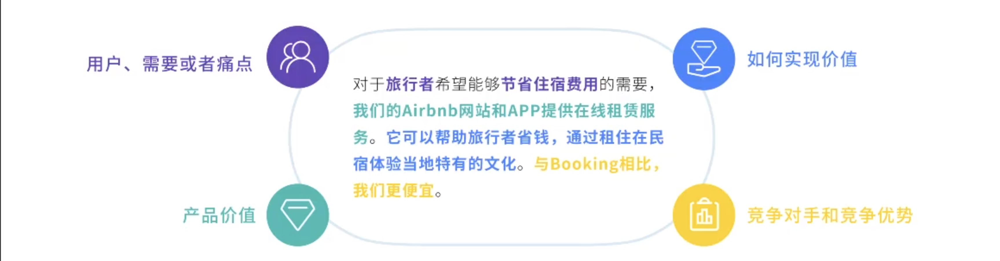

# 1.什么是电梯演讲

·电梯演讲是一种快速的方法，用来使团队对目标一致，并对产品的价值主张形成共识。
·这种简短的声明是一种令人印象深刻的方式，向任何受众传达产品愿景。
---
# <b>2.电梯演讲的四个要点</b>
#### 怎样做到对一个产品的描述简洁明了，但又概括了重要的信息？你需要注意这四个要
---

# <b>3.Uber的电梯演讲</b>
---

<table><tr><td bgcolor=yellow>背景色yellow</td></tr></table>

